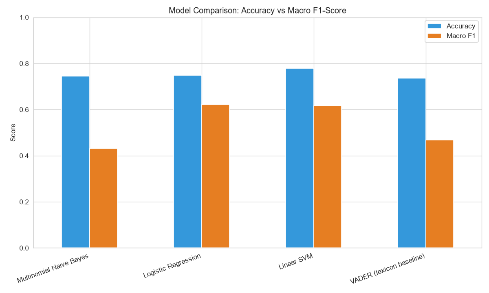
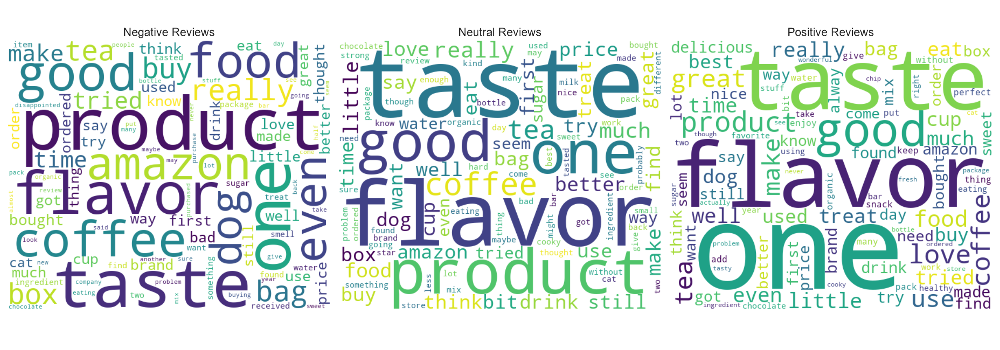
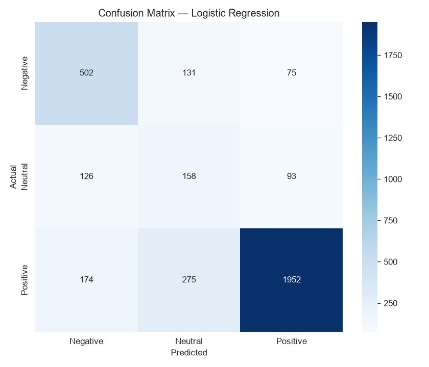

# 🛍️ Customer Review Sentiment Analysis using NLP & Machine Learning

**CodeAlpha Data Analytics Internship — Task 4: Sentiment Analysis**

A complete NLP pipeline that classifies Amazon customer reviews as **Positive**, **Neutral**, or **Negative**, comparing a lexicon-based approach (VADER) against multiple supervised machine learning models — with model interpretability and business insights.

---

## Objective

Analyze real-world customer reviews to:
- Classify text into sentiment categories using NLP + ML
- Compare rule-based (lexicon) sentiment scoring vs supervised ML models
- Understand *what drives* each sentiment class (word-level interpretability)
- Extract business insights that could inform product & marketing decisions

---

## Dataset

**Amazon Fine Food Reviews** — 568,454 real customer reviews (1999–2012)
Source: [Kaggle — Amazon Fine Food Reviews](https://www.kaggle.com/datasets/snap/amazon-fine-food-reviews)

> Note: `Reviews.csv` in this repo is a **13MB representative random sample** (~25,600 rows) of the original 287MB dataset, kept lightweight for GitHub. The notebook code works identically on the full dataset — just download it from Kaggle and replace the file if you want to reproduce results at full scale.

| Column | Description |
|---|---|
| `Score` | Star rating (1–5) given by the reviewer |
| `Text` | Full review text |
| `Summary` | Short review headline |
| `HelpfulnessNumerator/Denominator` | How many users found the review helpful |

---

## Tech Stack

- **Python 3**
- **Pandas / NumPy** — data manipulation
- **Matplotlib / Seaborn** — visualization
- **NLTK** — stopwords, lemmatization, VADER sentiment lexicon
- **WordCloud** — visual word frequency
- **BeautifulSoup** — HTML tag cleaning
- **Scikit-learn** — TF-IDF vectorization, ML models, evaluation metrics

---

## Approach

1. **Data Cleaning** — remove duplicate reviews, validate helpfulness data
2. **Label Creation** — derive sentiment from star rating (1-2★ → Negative, 3★ → Neutral, 4-5★ → Positive)
3. **Exploratory Data Analysis** — class distribution, review length patterns, helpfulness by sentiment
4. **Class Balancing** — stratified sampling to prevent bias toward the majority (Positive) class
5. **NLP Preprocessing** — HTML/URL removal, lowercasing, stopword removal (negations preserved), lemmatization
6. **Baseline: VADER** — lexicon-based sentiment scoring (no training required)
7. **Feature Engineering** — TF-IDF vectorization (unigrams + bigrams)
8. **Model Training** — Multinomial Naive Bayes, Logistic Regression, Linear SVM
9. **Evaluation** — Accuracy, Macro F1-score, confusion matrix, classification report
10. **Interpretability** — top influential words per sentiment class (Logistic Regression coefficients)
11. **Testing** — model validated on new, unseen custom reviews

---

## Results

| Model | Accuracy | Macro F1-Score |
|---|---|---|
| **Logistic Regression** (Best — by Macro F1) | 0.749 | **0.621** |
| Linear SVM (highest raw accuracy) | **0.779** | 0.617 |
| Multinomial Naive Bayes | 0.745 | 0.432 |
| VADER (lexicon baseline) | 0.736 | 0.468 |

> **Why Logistic Regression, not Linear SVM?** Linear SVM has the highest raw accuracy, but the dataset is imbalanced (Positive reviews dominate), so accuracy alone is misleading — a model can score high accuracy just by favoring the majority class. **Macro F1-score** weighs all three classes equally, and Logistic Regression wins on that metric, meaning it performs more consistently across Negative, Neutral, *and* Positive reviews — not just the easy majority class.

The supervised ML models substantially outperform the generic lexicon-based baseline, particularly on the **Neutral** class, which VADER struggles to detect.



### Word Clouds by Sentiment


### Confusion Matrix (Best Model — Logistic Regression)


---

## Key Business Insights

- **~78% of raw reviews are positive**, indicating a strong positive-review majority in this dataset. This class imbalance should be considered when interpreting model performance.
- **Neutral reviews are the hardest to classify** for both VADER and ML — these often contain mixed feedback (e.g. "great taste but bad packaging") and deserve manual attention from product teams.
- **A domain-trained ML model clearly outperforms an off-the-shelf lexicon tool**, showing the value of training on your own labeled data for production use cases.
- **Helpfulness ratio varies by sentiment**, suggesting detailed negative/neutral reviews are especially useful to other shoppers and should be surfaced, not buried.

---

## 📁 Repository Structure

```
├── Sentiment_Analysis_Amazon_Reviews.ipynb   # Full analysis notebook (with outputs)
├── Reviews.csv                               # Sample dataset (13MB, ~25.6K reviews)
├── sentiment_model.pkl                       # Trained Logistic Regression model
├── tfidf_vectorizer.pkl                      # Fitted TF-IDF vectorizer
├── images/                                   # Charts referenced in this README
│   ├── model_comparison.png
│   ├── wordclouds.png
│   ├── confusion_matrix.png
│   ├── class_distribution.png
│   ├── feature_importance.png
│   ├── helpfulness_by_sentiment.png
│   └── review_length_distribution.png
└── README.md
```

---

## ▶️ How to Run

```bash
git clone https://github.com/Nandini04It/CodeAlpha_SentimentAnalysis.git
cd CodeAlpha_SentimentAnalysis
pip install pandas numpy matplotlib seaborn nltk wordcloud beautifulsoup4 lxml scikit-learn joblib
jupyter notebook Sentiment_Analysis_Amazon_Reviews.ipynb
```

Or load the saved model directly for predictions:

```python
import joblib
model = joblib.load("sentiment_model.pkl")
vectorizer = joblib.load("tfidf_vectorizer.pkl")

review = "The product quality was excellent and delivery was fast!"
prediction = model.predict(vectorizer.transform([review]))
print(prediction)  # -> ['Positive']
```

---

## Future Improvements

- Aspect-based sentiment analysis (separate sentiment per product attribute like taste, packaging, price)
- Transformer-based models (BERT / DistilBERT) for higher accuracy
- Deploy as an interactive Streamlit web app

---

## About

This project was built as part of the **CodeAlpha Data Analytics Internship**, Task 4: Sentiment Analysis.

**Connect:** [LinkedIn](https://linkedin.com/in/nandini-prajapati-it) | Tag [@CodeAlpha](https://www.linkedin.com/company/codealpha)
